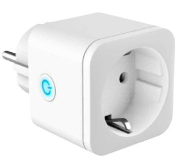

# Battery Laptop MQTT Publisher #
simple code for send your battery data from linux laptop to mqtt broker

## Tutorial ##
- clone this repo to your laptop
- change the mqtt configuration 
- build with go build -o battery_mqtt main.go
- sudo chmod +x battery_mqtt 
- copy battery_mqtt executable to /usr/local/bin
- copy battery-mqtt.service to /etc/systemd/system
- sudo systemctl daemon reload
- sudo systemctl enable battery-mqtt.service
- sudo systemctl start battery-mqtt.service

## Automation ##
- in this case, i'm using Home assistant for set the all automation shceme
- and also use this smartplug, you can shange it with your esp+relay or etc
 

